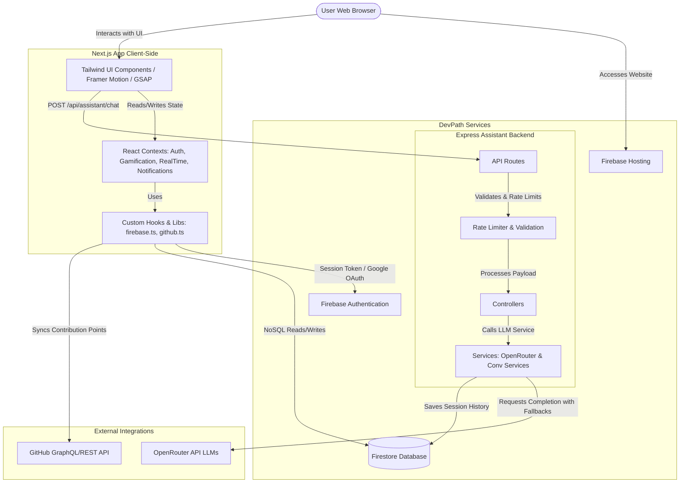
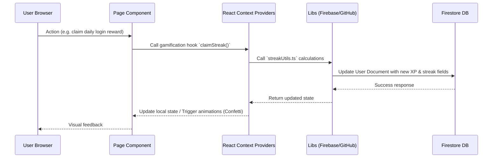
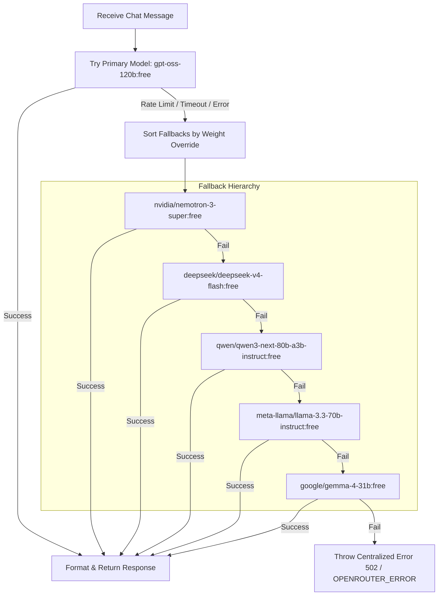
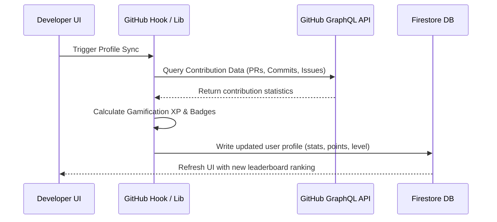

# DevPath Architecture Documentation

Welcome to the DevPath architecture documentation. This document outlines the system architecture, folder structures, component dependencies, and design patterns utilized in the DevPath Bharat Community Platform.

---

## 🗺️ System Architecture Overview

DevPath is built on a modern, decoupled architecture:

1. **Frontend (Client-Side)**: A fast, responsive Next.js 16 (App Router) client deployed on Firebase Hosting.
2. **Backend (Server-Side)**: A lightweight Express.js server responsible for securely calling APIs (e.g., OpenRouter LLM APIs) and managing the floating assistant chat state.
3. **Database & Infrastructure Services**: Managed by Google Firebase (Authentication, Cloud Firestore, Hosting, and Security Rules).
4. **Third-Party Integrations**: GitHub API (for gamification sync) and OpenRouter (for AI-powered learner assistant).

### High-Level System Flow Diagram



---

## 🎨 Client-Side Architecture (Next.js Application)

The client application is built on top of React 19 and Next.js 16 utilizing the App Router. The UI layers are styled with Tailwind CSS and animated using Framer Motion and GSAP.

### 📁 Directory Structure

- **`src/app/`**: Next.js App Router folders. Contains page routes, global CSS, layouts, and route handlers.
- **`src/components/`**: Modularized, reusable React components (grouped logically into domains like `auth`, `assistant`, `community`, `projects`, `ui`).
- **`src/context/`**: Global state management providers using the React Context API:
  - `AuthContext.tsx`: Tracks authentication state (Firebase user, login, signup, logout).
  - `GamificationContext.tsx`: Manages streak tracking, contribution points, and leaderboard sync status.
  - `NotificationContext.tsx`: Manages toast feedback, in-app notifications, and alert center state.
  - `RealTimeContext.tsx`: Handles live user count, active pages, or presence updates.
- **`src/lib/`**: Business logic integrations:
  - `firebase.ts`: SDK initialization for Auth and Firestore.
  - `github.ts`: Fetching public repositories, contribution counts, and PR stats.
  - `theme.ts`: Custom dark/light mode configurations.
  - `streakUtils.ts`: Computes login streaks and calculates XP modifiers.

### ⚡ Client-Side State Flow



---

## ⚙️ Server-Side Architecture (Express Assistant Backend)

The Express backend orchestrates heavy or secure calculations, specifically focusing on the AI Chat Assistant capabilities. It runs separately (under the `/backend` directory) and communicates with the client via JSON endpoints.

### 📂 File Structure (under `backend/src/`)

- **`app.js`**: Global middlewares configuration (CORS, Express JSON parser, Request logs with Morgan).
- **`routes/assistant.js`**: Defines the assistant pathways. Includes rate-limiting and request payload validator middlewares.
- **`controllers/assistantController.js`**: Resolves HTTP requests, handles errors, and returns JSON formatted chat responses.
- **`services/openRouterService.js`**: Orchestrates OpenAI/OpenRouter chat generation with failover retry patterns.
- **`services/conversationService.js`**: Manages conversational message histories and stores session contexts in Firestore using the Firebase Admin SDK.
- **`middlewares/rateLimitMiddleware.js`**: Prevents brute-force requests and keeps cost consumption predictable.

### 🚀 LLM Multi-Model Failover Orchestration

The assistant service uses a custom failover logic across free OpenRouter endpoints to maintain 100% availability.



---

## 🗄️ Database & Security Architecture (Firebase)

DevPath utilizes Firebase as a serverless backend helper. Because the frontend talks directly to Firebase, security is enforced via server-side database rules.

### 📝 Database Collections (Firestore NoSQL)

```
/users (user metadata, registration dates, display name, roles)
  ├── /streaks (sub-collection: login streaks, last login timestamps)
  └── /notifications (sub-collection: read/unread notification feed)

/resources (curated learning resources, paths, and wiki articles)
  └── /ratings (sub-collection: user feedback and ratings)

/events (hackathons, workshops, meetups details)
  └── /registrations (sub-collection: RSVP records)

/conversations (saved chat history for the assistant)
```

### 🔒 Firestore Security Rules

To avoid data manipulation, `firestore.rules` enforces that:

- Users can only read and write their own `/users/{userId}` documents, streaks, and notifications.
- Only accounts flagged with the `admin` role are permitted to create, update, or delete entries under `/events` and `/resources`.
- Authenticated users can create registrations and write reviews/ratings.

---

## 🤝 Contribution and Sync Pipelines

DevPath tracks developer progress and gamifies learning through automated sync pipelines.



### Point Calculation Rules

- **Pull Request Merged**: High XP yield (+50 pts)
- **Issue Opened/Resolved**: Medium XP yield (+15 pts)
- **Daily Learning Streak**: Consistent daily progress boosts multiplier (up to 1.5x)
